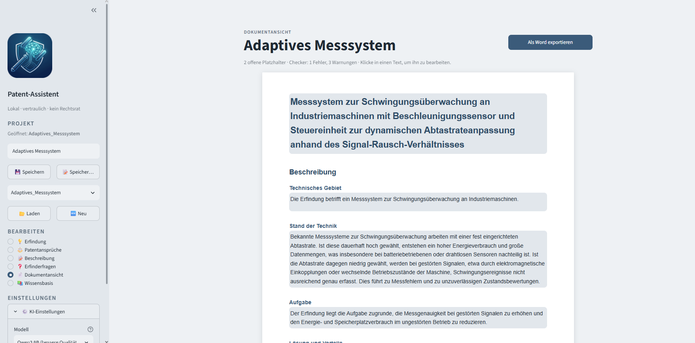
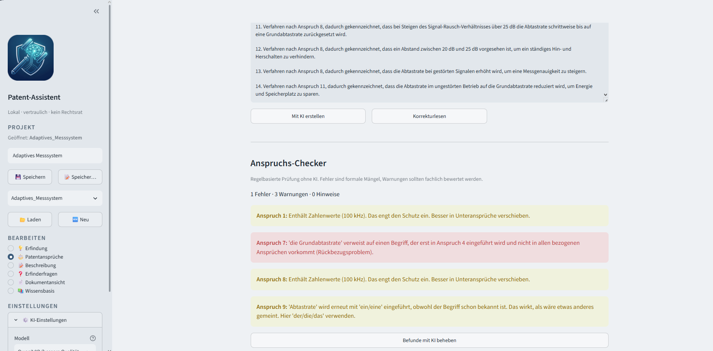
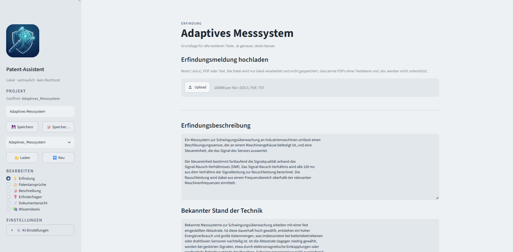
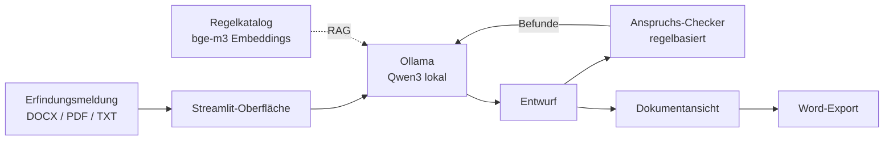

<p align="center">
  
</p>

<h1 align="center">Patent-Assistent</h1>

<p align="center">
  Lokaler KI-Assistent für Entwürfe deutscher Patentanmeldungen.<br>
  Vertrauliche Erfindungen verlassen nie den eigenen Rechner.
</p>

<p align="center">
  <a href="https://github.com/weber-alexander/patent-assistant/actions/workflows/ci.yml"></a>
  
  
  
</p>

> **English summary:** A local, privacy-first drafting assistant for German patent applications.
> It runs open-weight LLMs via Ollama, combines AI drafting with a rule-based claim checker,
> and exports a structured Word document. No cloud, no data leaves the machine.



---

## Warum?

Erfindungsmeldungen sind streng vertraulich. Cloud-KI-Dienste kommen für viele Kanzleien und
Patentabteilungen deshalb nicht infrage. Dieses Projekt zeigt, dass ein brauchbarer
Entwurfsassistent auch **vollständig lokal** auf einem normalen Büro-Laptop laufen kann.

Das Leitprinzip: **KI schreibt, Regeln prüfen, der Mensch entscheidet.**

## Funktionen

- **Erfindungsmeldung importieren:** Word, PDF oder Text, inklusive Formular-Tabellen, mit bearbeitbarer Vorschau
- **Entwurf aller Abschnitte** einer deutschen Anmeldung: Patentansprüche, Titel, Technisches Gebiet, Stand der Technik, Aufgabe, Lösung und Vorteile, Ausführungsbeispiel, Zusammenfassung
- **Gesamtentwurf auf Knopfdruck** mit Fortschrittsanzeige und Zeitmessung, oder Abschnitt für Abschnitt
- **Regelbasierter Anspruchs-Checker** (ohne KI), u. a. für
  - Nummerierung und Rückbezüge auf nicht existierende oder nachfolgende Ansprüche
  - Begriffe, die mit „der/die/das“ verwendet, aber nie eingeführt wurden (inkl. Rückbezugsproblemen)
  - erneute Einführung bereits bekannter Begriffe mit „ein/eine“
  - Zahlenwerte im unabhängigen Anspruch und unklare Begriffe („etwa“, „signifikant“ …)
- **Befunde per KI beheben:** Die Korrektur wird gegen den Checker geprüft
- **Erfinderfragen:** gezielte Rückfragen zu Lücken in der Erfindungsmeldung
- **Platzhalter statt Erfindungen:** Fehlende Angaben werden als `[ERGÄNZEN: …]` markiert statt halluziniert
- **Dokumentansicht** im Layout des Exports, direkt bearbeitbar
- **Word-Export (DOCX)** mit gelb markierten offenen Platzhaltern
- **Wissensbasis (RAG)** mit kuratiertem Regelkatalog (PatG, PatV, DPMA-Praxis)
- Korrekturlesen, Rückgängig, Projekte speichern und laden

<p>
  
  
</p>

## So funktioniert es



Alle Komponenten laufen lokal. Eine Internetverbindung wird nur für die Erstinstallation benötigt.

## Installation

### Voraussetzungen

| | |
|---|---|
| Betriebssystem | Windows 10 / 11 |
| Arbeitsspeicher | **16–32 GB RAM** empfohlen |
| Speicherplatz | ca. 15 GB frei |
| Internet | nur für die Erstinstallation |

### In drei Schritten

1. Repository herunterladen: **Code → Download ZIP** und entpacken (oder `git clone`)
2. **Doppelklick auf `start.bat`**
3. Beim ersten Start im Browser auf **„Modelle jetzt herunterladen“** klicken

Das Startskript installiert bei Bedarf automatisch [uv](https://docs.astral.sh/uv/) (inkl. Python) und
[Ollama](https://ollama.com), richtet alle Pakete in einer isolierten Umgebung ein und legt eine
Verknüpfung **„Patent-Assistent“** auf dem Desktop und im Startmenü an. Danach startet die App
wie jedes andere Programm.

**Beenden:** das minimierte Fenster „Patent-Assistent“ in der Taskleiste schließen.

## Modelle

| Modell | Rolle | Größe |
|---|---|---|
| `qwen3:4b-instruct` | Standard: schnell, ohne Denkmodus | ca. 2,5 GB |
| `qwen3:8b` | Bessere Qualität, langsamer (Denkmodus wird automatisch deaktiviert) | ca. 5,2 GB |
| `bge-m3` | Embeddings für die Wissensbasis | ca. 1,2 GB |

Das zuletzt verwendete Modell wird pro Projekt und global gemerkt.

## Konfiguration

Alle Einstellungen lassen sich über Umgebungsvariablen anpassen, ohne Code zu ändern:

| Variable | Standard | Bedeutung |
|---|---|---|
| `PA_CHAT_MODELS` | `qwen3:4b-instruct,qwen3:8b` | Auswählbare Modelle (das erste ist Standard) |
| `PA_EMBED_MODEL` | `bge-m3` | Modell für die Wissensbasis |
| `PA_OLLAMA_HOST` | `http://127.0.0.1:11434` | Adresse des Ollama-Servers |
| `PA_TEMPERATURE` | `0.3` | Kreativität des Modells (niedrig = sachlich) |
| `PA_CONTEXT_WINDOW` | `8192` | Kontextlänge in Tokens |
| `PA_PROJECTS_DIR` | `projects` | Speicherort der Projekte |
| `PA_KNOWLEDGE_DIR` | `knowledge` | Ordner der Wissensbasis |

Beispiel für einen Rechner mit 32 GB RAM (danach App neu starten, fehlende Modelle werden angeboten):

```powershell
setx PA_CHAT_MODELS "qwen3:8b,qwen3:14b"
```

Die Arbeitsanweisungen für die KI liegen gebündelt in
[`src/patent_assistant/prompts.py`](src/patent_assistant/prompts.py) und können von Kanzleien angepasst werden.

## Wissensbasis

Der Ordner `knowledge/` enthält den kuratierten Regelkatalog `rules_dpma.txt`
(eine Regel pro Absatz, mit Fundstelle). Zusätzlich können PDF- oder TXT-Dateien abgelegt werden, z. B.:

- [Patentgesetz (PatG)](https://www.gesetze-im-internet.de/patg/PatG.pdf)
- [Patentverordnung (PatV)](https://www.gesetze-im-internet.de/patv/PatV.pdf)
- Prüfungsrichtlinien Patente des DPMA ([dpma.de](https://www.dpma.de))

Danach auf der Seite „Wissensbasis“ den Index aufbauen und in den KI-Einstellungen RAG aktivieren.
Kanzleien können hier auch eigene Leitfäden und Formulierungsvorgaben hinterlegen.

## Erkenntnisse aus der Entwicklung

- **Rohe Gesetzestexte sind schlechte RAG-Quellen.** Die semantische Suche lieferte oft irrelevante
  Treffer (Blattformat, Gebühren). Ein kurzer, kuratierter Regelkatalog brachte präzise Treffer und
  sichtbar sachlichere Texte.
- **Kleine Modelle befolgen Regeln nur teilweise.** Prompts mit Beispielen aus fremden Fachgebieten
  wirken besser als reine Regellisten. Was zuverlässig prüfbar ist, prüft deshalb Code statt KI.
- **Platzhalter statt Raten:** Ohne Angaben zum Stand der Technik beschreibt ein kleines Modell
  gern die Erfindung selbst als bekannt. Die App setzt in diesem Fall bewusst keinen KI-Text.

## Bekannte Grenzen

- Entwürfe, keine fertigen Anmeldungen. Ergebnisse müssen fachlich geprüft werden
- Ausgelegt auf **deutsche Anmeldungen**. Keine Zeichnungen und Bezugszeichen
- Der Checker arbeitet heuristisch: Artikelprüfungen können vereinzelt Fehlalarme erzeugen,
  Grammatik (z. B. Singular/Plural) und inhaltliche Fragen werden nicht geprüft
- Gescannte PDFs ohne Textebene und das alte `.doc`-Format werden nicht unterstützt
- Die Fortschrittsanzeige ist eine Schätzung
- Entwickelt und getestet auf einem Laptop mit 16 GB RAM mit `qwen3:4b-instruct`.
  Größere Modelle liefern deutlich bessere Texte ohne Codeänderung

## Entwicklung

```powershell
uv sync                                  # Umgebung inkl. Entwicklerwerkzeuge
uv run streamlit run src/patent_assistant/app.py
uv run pytest                            # Tests (ohne KI, in unter einer Sekunde)
uv run ruff check src scripts tests      # Linting
uv run ruff format src scripts tests     # Formatierung
```

Bei jedem Push prüft GitHub Actions Linting, Formatierung und Tests unter Linux und Windows.

```
src/patent_assistant/
├── app.py              Streamlit-Oberfläche
├── claim_checker.py    regelbasierter Anspruchs-Checker
├── prompts.py          alle Arbeitsanweisungen für die KI
├── llm.py              Anbindung an Ollama
├── knowledge_base.py   lokale Wissensbasis (RAG, ohne Datenbank)
├── file_import.py      Import von DOCX, PDF, TXT
├── document_export.py  Word-Export
├── projects.py         Speichern und Laden
├── user_state.py       persönliche Einstellungen
└── config.py           Konfiguration
```

## Ausblick

- Texterkennung (OCR) für gescannte Erfindungsmeldungen
- Weitere Templates (EP, PCT)
- Rich-Text-Editor mit Formatierung
- Startskript für macOS

## Haftungsausschluss

Dieses Projekt ist ein privates Lern- und Portfolio-Projekt. Es stellt **keine Rechtsberatung** dar
und ersetzt nicht die Prüfung durch eine Patentanwältin oder einen Patentanwalt.
Alle Beispiele im Repository sind fiktiv.

## Lizenz

[MIT](LICENSE) © Alexander Weber